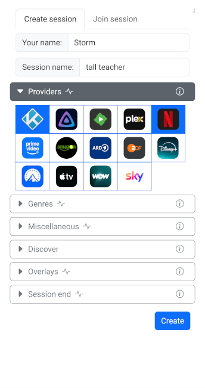
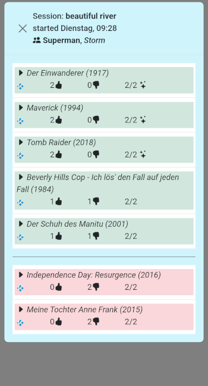

# K-inder

K-inder gives you the ability to "swipe" through your kodi database with your friends and find your movie match.

## Requirements

For now there are some assumptions for this to work:

* Working docker / podman installation.
* Kodi API is accessable.
* pull docker image via `docker pull docker.io/effex7/kinder:latest`
* ~~All your movies integrated via a single samba share.~~
* ~~All movies are exported into single files per movie.~~

Samba share and single files export is not necessary to work, but may result in more stable poster results. I try to fetch the posters from the image URLs I receive from the KODi API but these might be deprecated and lead to many 404 results.

## Settings

The following environment variables have to be set on runtime:

* KT_KODI_USERNAME : Username to access your Kodi API.
* KT_KODI_PASSWORD : Password to access your Kodi API.
* KT_KODI_HOST : Host (usually ip:port) of your Kodi instance.
* KT_SMB_USER : Username to access your samba share.
* KT_SMB_PASSWORD : Password to access your samba share.

There are more settings, but they are just interesting for development. Take a look at the [Dockerfile](./Dockerfile) for a complete list.

## Quickstart your voting session

Run (and pull) the docker image with:

`docker run -it --rm -e KT_KODI_USERNAME=kodi -e KT_KODI_PASSWORD=kodi -e KT_KODI_HOST=192.168.0.100:8080 -e KT_SMB_USER=movies -e KT_SMB_PASSWORD=movies -p 5000:5000 docker.io/effex7/kinder:latest`

Start a browser (for example on your mobile) and open http://ip:5000 where ip is the ip of the computer you starter K-inder on.

Enter a name for you and your session.

Now your movies will be presented to you (and everyone else who joined the same session) and you can vote yes (click/touch right) or no (click/touch left).

In the upper left corner you can access the actual top / flop 3 (movies with most pros and movies with most cons).

Thats it.

## More detailed start

Like for all docker images, you can also create a docker-compose.yml to keep your starting command shorter. Or create a .env file with your environment settings and pass it like:

`docker run -it --rm --env-file=.env -p 5000:5000 docker.io/effex7/kinder:latest`

If you want to keep your session, you need to map a data folder into the container. E.g. `-v ./data:/data`

In this example you have to make sure, that the *data* folder exists in your hosts current directory.

Its also possible to keep the log file There for you have to map a log foler into the container. E.g. `-v ./log:/log`

In this example you have to make sure, that the *log* folder exists in your hosts current directory.

All fetched poster images can also be kepped / restored over sessions (server starts). Therefore you have to map a cache folder into the container. E.g. `-v ./cache:/cache`

In this example you have to make sure, that the *cache* folder exists in your hosts current directory.
Of course this way its also possible to manipulate the posters for each movie ;-)

As mentioned above, there are also some more environment variables, for example you can set` KT_SERVER_SWAGGER=True` to access the REST API directly under http://ip:5000/apidocs/ where ip is the ip of the computer you started K-inder on. Or set `KT_LOG_LEVEL='DEBUG'` to get a more detailed log output.

Put all this together and you would result in a docker call like:

`docker run -it --rm --env-file=.env -v ./data:/data -v ./log:/log -v ./cache:/cache -p 5000:5000 docker.io/effex7/kinder:latest`

## Some planed features

Most important: More options for a session. E.g.: ~~Ignore some genres~~ Already available. Ignore already watched movies. Ignore already pro-voted / con-voted movies from previous sessions.

Also: ~~Don't access only samba shares. It should be possible to also access direct files or even every source that could be included into Kodi.~~ Kind of done. But the most stable way (for now) is still the file access (via samba). I also fetch some URLs for images from the KODi API, but these URLs are often deprecated. Escpecially if the movie was added a longer time ago.

## Disclaimer

The software is provided as is. It is in a very early state but its working for me. I hope that someone out there can use it or even help me improve it. So please send me your feedback!

## Impressions

Login Screen:

Voting with poster available:

Voting with no poster available:

Top/Flop Overview

