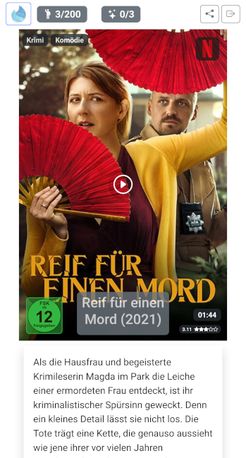

# K-inder

K-inder gives you the ability to "swipe" through your kodi database with your friends and find your movie match.

## Requirements

For now there are some assumptions for this to work:

* Working docker / podman installation.
* (Kodi API is accessable.) Not needed for streaming provider voting!
* pull docker image via `docker pull docker.io/effex7/kinder:latest`

## Settings

The following environment variable **must** to be set before starting with Kodi. They are not needed for streaming provider voting:

* KT_KODI_HOST : Host of your Kodi instance. eg: 192.168.0.100

The following environment variable **must** be set before starting with Emby. They are not needed for streaming provider voting:

* KT_EMBY_URL : The url of your Emby instance. eg: https://emby.example.com/
* KT_EMBY_API_KEY : API Key/Token for your emby instance. 

The following environment variable **must** be set before starting with Jellyfin. They are not needed for streaming provider voting:

* KT_JELLYFIN_URL : The url of your Emby instance. eg: https://jellyfin.example.com/
* KT_JELLYFIN_API_KEY : API Key/Token for your Jellyfin instance. 

The following environment variable **must** be set before starting with Plex. They are not needed for streaming provider voting:

* KT_PLEX_URL : The url of your Emby instance. eg: https://plex.example.com/
* KT_PLEX_API_KEY : API Key/Token for your Plex instance. For receiving your Plex Token, take a look at [Plexopedia](https://www.plexopedia.com/plex-media-server/general/plex-token/).

The following environment variables **may** be set before start:

* KT_KODI_USERNAME : Username to access your Kodi API. Default is _kodi_.
* KT_KODI_PASSWORD : Password to access your Kodi API. Default is _kodi_.
* KT_KODI_PORT : Port of your Kodi instance. Default is _8080_.
* KT_KODI_TIMEOUT : timeout for connections to kodi.
* KT_JELLYFIN_TIMEOUT : timeout for connections to jellyfin.
* KT_EMBY_TIMEOUT : timeout for connections to emby.
* KT_PLEX_TIMEOUT : timeout for connections to plex.
* KT_TMDB_API_REGION : Region you want to match your Streaming Provider results.
* KT_SMB_USER : Username to access your samba share.
* KT_SMB_PASSWORD : Password to access your samba share.

There are more settings. Some are only interesting for [development](#more-detailed-start), some for [customisation](#some-customisation-options), some others are for [poster overlays](#more-details-about-what-to-display-as-overlay), some are for [filter settings](#more-details-about-how-to-set-the-filter-settings) and you can also definde the [end conditions](#more-details-about-the-end-conditions). Take a look at the [Dockerfile](./Dockerfile) for a complete list.

## Quickstart your voting session

### Docker CLI

Run (and pull) the docker image with:

`docker run -it --rm -e KT_KODI_HOST=192.168.0.100 -p 5000:5000 docker.io/effex7/kinder:latest`

(after changing all environment variables to fit your setup!)

### Compose file

Alternativly you can use the [docker-compose example file](./docker-compose-example.yml), edit it, to fit your setup, rename it to docker-compose.yml and start it via

`docker-compose up`

### Open Browser

Start a browser (for example on your mobile) and open http://ip:5000 where ip is the ip of the computer you starter K-inder on.

Enter a name for you and your session.

Now your movies will be presented to you (and everyone else who joined the same session) and you can vote yes (click/touch right) or no (click/touch left).

In the upper left corner you can access the actual top / flop 3 (movies with most pros and movies with most cons).

Thats it.

## More detailed start

Like for all docker images, you can also create a docker-compose.yml to keep your starting command shorter. (You can use the [example](./docker-compose-example.yml) for starter) Or create a .env file with your environment settings and pass it like:

`docker run -it --rm --env-file=.env -p 5000:5000 docker.io/effex7/kinder:latest`

If you want to keep your session, you need to map a data folder into the container. E.g. `-v ./data:/data`

In this example you have to make sure, that the *data* folder exists in your hosts current directory.

Its also possible to keep the log file There for you have to map a log foler into the container. E.g. `-v ./log:/log`

In this example you have to make sure, that the *log* folder exists in your hosts current directory.

All fetched poster images can also be kepped / restored over sessions (server starts). Therefore you have to map a cache folder into the container. E.g. `-v ./cache:/cache`

In this example you have to make sure, that the *cache* folder exists in your hosts current directory.
Of course this way its also possible to manipulate the posters for each movie ;-)

As mentioned above, there are also some more environment variables, for example you can set` KT_SERVER_SWAGGER=True` to access the REST API directly under http://ip:5000/apidocs/ where ip is the ip of the computer you started K-inder on. Or set `KT_LOG_LEVEL='DEBUG'` to get a more detailed log output.

Put all this together and you would result in a docker call like:

`docker run -it --rm --env-file=.env -v ./data:/data -v ./log:/log -v ./cache:/cache -p 5000:5000 docker.io/effex7/kinder:latest`

### Some customisation options

#### Match Options

By default you can just see your "voting results" without any actions given. But with `KT_MATCH_ACTION` you can also provide a play button, for instant play start in kodi. Later there may be some more options around this setting ;-)

You can also define how many TOP movies should be displayed in the Stats (top/flop overview) with `KT_TOP_COUNT`. And as younterpart there is also `KT_FLOP_COUNT`. The default for both is 3.

#### Streaming provider movie base

For Kodi its very obvious, which movies should be voted about: All your Kodi movies :-)
But for the streaming provider its not that simple. First the complete catalouge would be to much. But more important: I don't know an API, where I can fetch all movies from Netflix or any other streaming provider.

There for I use the tmdb API. Its very powerfull and gives the oportunity to filter movies that are available at a given provider. BUT its still not the complete list! I can tell the API to order the movies and then fetch pages of this list. You can control/filter this list by the following environment variables:

* KT_TMDB_API_DISCOVER_SORT_BY : The base sorting. Default is popularity. Valid values are: popularity|original_title|revenue|primary_release_date|title|vote_average|vote_count
* KT_TMDB_API_DISCOVER_SORT_ORDER : Sort direction. Default is desc. Valid values are: asc|desc
* KT_TMDB_API_DISCOVER_VOTE_AVERAGE : The least vote average. Only movies with at least this vote average will be listed. Default is empty (= no restrictions)
* KT_TMDB_API_DISCOVER_VOTE_COUNT : At least this number of votes must be given. Default is empty (= no restrictions)
* KT_TMDB_API_DISCOVER_TOTAL : Total movies that will be fetched. Default is 200, values > 1000 will be cut to 1000.
~~* KT_TMDB_API_DISCOVER_CHUNKS=1~~
~~* KT_TMDB_API_DISCOVER_DISTRIBUTION=0.0~~

Don't get this wrong: This is NOT the order the movies will be presented to you! I will fetch the first KT_TMDB_API_DISCOVER_TOTAL movies by the given order, then randomize these movies and then they will be presented to you ;-)

Take a look at the [Dockerfile](./Dockerfile) for valid values or at the [tmdb API documentation](https://developer.themoviedb.org/reference/discover-movie).

### More details about what to display as overlay

Maybe you want to see the poster only? Or would like to see the viewd state? There are some overlays that can be enabled or disabled. For now these are:

* KT_OVERLAY_TITLE : display the title of the movie
* KT_OVERLAY_DURATION : display the duration of the movie
* KT_OVERLAY_GENRES : display the genres of the movie
* KT_OVERLAY_WATCHED : display it the movie was already watched (viewcount > 0)
* KT_OVERLAY_AGE : display the FSK/PG rating of the movie

All these environment variables can be set `True` or `False` (in .env file, or docker-compose, or docker cli parameter) to enable or disable the corresponding overlay.

### More details about how to set the filter settings

Instead of always setting the same filter defaults for each new session, you can define the defaults.

* KT_FILTER_DEFAULT_PROVIDER : Comma seperated names of providers you want to fetch movies from. Take a look at the [Dockerfile](./Dockerfile) for valid values.
* KT_FILTER_DEFAULT_DISABLED_GENRES : Comma separated names of the genres you want to preselect for "Anti-Genres"
* KT_FILTER_DEFAULT_MUST_GENRES : Comma separated names of the genres you want to preselect for "Must-Genres"
* KT_FILTER_DEFAULT_MAX_AGE : Default max age value. Take a look at the [Dockerfile](./Dockerfile) for valid values.
* KT_FILTER_DEFAULT_MAX_DURATION : Default max duration value. Take a look at the [Dockerfile](./Dockerfile) for valid values.
* KT_FILTER_DEFAULT_INCLUDE_WATCHED : True|False for default include watched check
* KT_FILTER_DEFAULT_MIN_YEAR : Minimum release date year. Default is 1900
* KT_FILTER_DEFAULT_MAX_YEAR : Maximum release date year. Default is none, which means the actual year

But you can also hide the filter, if you don't need them.

* KT_FILTER_HIDE_PROVIDER : True|False to hide/show the provider selection.
* KT_FILTER_HIDE_DISABLED_GENRES : True|False to hide/show the Anti-Genres.
* KT_FILTER_HIDE_MUST_GENRES : True|False to hide/show the the Must-Genres.
* KT_FILTER_HIDE_MAX_AGE : True|False to hide/show the max age.
* KT_FILTER_HIDE_MAX_DURATION : True|False to hide/show the max duration.
* KT_FILTER_HIDE_INCLUDE_WATCHED : True|False to hide/show the include watched checkbox.
* KT_FILTER_HIDE_OVERLAY : True|False to hide/show the overlay selection.
* KT_FILTER_HIDE_MIN_YEAR : True|False to hide/show the min year input.
* KT_FILTER_HIDE_MAX_YEAR : True|False to hide/show the max year input.
* KT_HIDE_END : True|False to hide/show the limit selection.

Of corse Hiding and preselection can be combined. E.g.: You just need kodi an no other provider, just set `KT_FILTER_DEFAULT_PROVIDER` to kodi and `KT_FILTER_HIDE_PROVIDER` to True. So kodi will always be preselected and can not be deselected, because the filter is hidden.

### More details about the end conditions

The voting will of corse always be over, if there are no more movies left for voting. But besides that, you can define some more end conditions:

- KT_DEFAULT_END_MAX_MINUTES : The minutes after creating the session, the vote will be over. <= 0 means endless.
- KT_DEFAULT_END_MAX_VOTES : The number of movies a user can vote for, before the session is over. <= 0 means no limit.
- KT_DEFAULT_END_MAX_MATCHES : Number of matches, before the session is over. <= 0 means no limit.

Some of the options may collide with the possibility to revote. So maybe the last revote will be possible even if no new votes will be accepted for the session.

## Disclaimer

The software is provided as is. It is in a very early state but its working for me. I hope that someone out there can use it or even help me improve it. So please send me your feedback!

## Impressions

Session creation screen:

Voting for Kodi with poster available:

Voting for Netflix with poster available:

Voting with no poster available:

Top/Flop Overview

